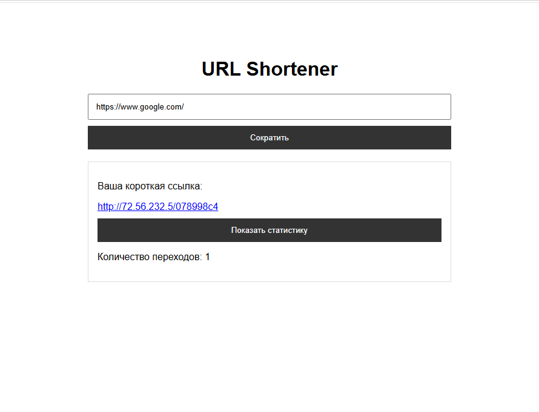
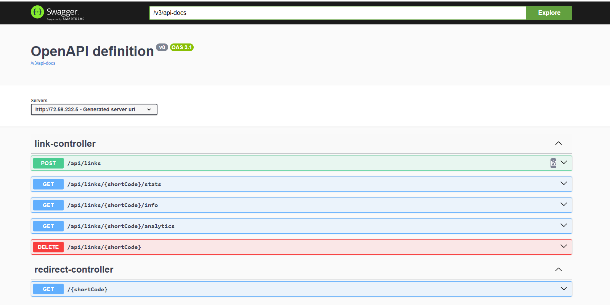
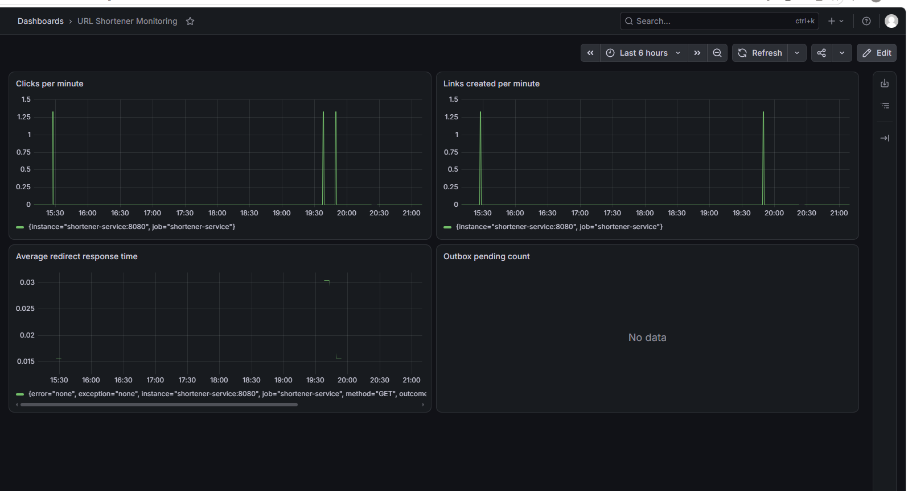

# URL Shortener

Микросервисный сервис для сокращения ссылок, созданный как учебный
backend-проект.

**Живой сервис:** http://186.246.7.121/app
**Swagger UI:** http://186.246.7.121/swagger-ui/index.html

## Интерфейс



## Стек технологий

-   Java 17
-   Spring Boot 3
-   PostgreSQL
-   Liquibase
-   Redis
-   Apache Kafka
-   Docker, Docker Compose
-   Prometheus, Grafana
-   Kubernetes (Minikube)
-   Nginx
-   VPS

## Архитектура

Проект состоит из двух сервисов:

-   `shortener-service` --- создаёт короткие ссылки, выполняет редирект,
    хранит данные и публикует события о переходах в Kafka.
-   `analytics-service` --- получает события из Kafka и хранит аналитику
    переходов.

Основной поток:

``` text
Client
  |
  v
Nginx
  |
  v
shortener-service
  |        |        |
  v        v        v
PostgreSQL Redis   Kafka
                    |
                    v
             analytics-service
                    |
                    v
             PostgreSQL
```

## API

  ------------------------------------------------------------------------------------
  Метод                   Эндпоинт                             Описание
  ----------------------- ------------------------------------ -----------------------
  `POST`                  `/api/links`                         Создать короткую ссылку

  `GET`                   `/{shortCode}`                       Перейти по короткой
                                                               ссылке (`302 Found`)

  `GET`                   `/api/links/{shortCode}/info`        Получить информацию о
                                                               ссылке

  `GET`                   `/api/links/{shortCode}/stats`       Получить количество
                                                               переходов

  `GET`                   `/api/links/{shortCode}/analytics`   Получить аналитику
                                                               переходов

  `DELETE`                `/api/links/{shortCode}`             Удалить короткую ссылку
  ------------------------------------------------------------------------------------

## Swagger

API задокументирован с помощью Swagger/OpenAPI.



## Что реализовано

-   ✅ Создание коротких ссылок
-   ✅ Редирект по короткому коду
-   ✅ Валидация URL
-   ✅ Срок действия ссылки и обработка истёкших ссылок (`410 Gone`)
-   ✅ Подсчёт переходов
-   ✅ Redis-кэш для редиректов
-   ✅ Kafka для асинхронной передачи событий о переходах
-   ✅ Отдельный `analytics-service`
-   ✅ PostgreSQL и миграции Liquibase
-   ✅ Docker Compose для запуска инфраструктуры и сервисов
-   ✅ Метрики Spring Boot через Prometheus
-   ✅ Grafana dashboard
-   ✅ Kubernetes-манифесты для запуска в Minikube
-   ✅ Деплой на VPS
-   ✅ Nginx reverse proxy

## Мониторинг

Для мониторинга используются Prometheus и Grafana.

Dashboard содержит четыре панели, предусмотренные ТЗ:

-   количество переходов в минуту;
-   количество созданных ссылок в минуту;
-   среднее время ответа на редирект;
-   `outbox.pending.count`.

Панель `outbox.pending.count` подготовлена заранее и начнёт получать
данные после реализации соответствующей метрики на следующем этапе
проекта.



## Как запустить локально

Клонировать репозиторий:

``` bash
git clone https://github.com/Lis1yHub/shortener-service.git
cd shortener-service
```

Создать `.env` с необходимыми переменными окружения и запустить проект:

``` bash
docker compose up -d --build
```

Проверить контейнеры:

``` bash
docker compose ps
```

После запуска:

-   Frontend: http://localhost:8080
-   Swagger: http://localhost:8080/swagger-ui/index.html
-   Grafana: http://localhost:3000
-   Prometheus: http://localhost:9090

## Деплой

Проект развёрнут на VPS. Nginx используется как reverse proxy, поэтому
frontend, REST API, Swagger и короткие ссылки доступны через внешний IP
без указания порта `8080`.

**Frontend:** http://186.246.7.121/app\
**Swagger:** http://186.246.7.121/swagger-ui/index.html
